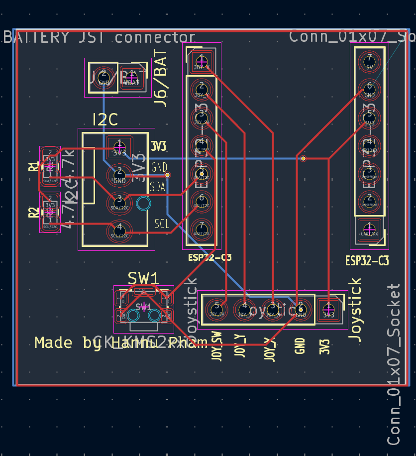

# ESP32-C3 BLE Development Board

> **Status:** Work in Progress (Incomplete and untested)

A custom, ultra-compact devboard designed specifically for a Bluetooth Low Energy (BLE) project.

## Specifications

* **MCU:** ESP32-C3
* **PCB Size:** ~30 x 25 mm
* **Connectivity:** JST connectors or standard female Dupont headers

## Pin Connections

* **I2C:** [Add specific GPIOs, e.g., SDA: GPIO4, SCL: GPIO5]
* **Battery:** [Add power input details]
* **Joystick:** [Add pin mapping]
* **SW1:** [Add button pin]

## PCB Preview

## Next Steps

* [ ] Implement a circuit/method to accurately measure low-power consumption.
* [ ] Expand pin breakouts and connections for more universal prototyping use.
* [ ] Explore designing a completely scratch-built revision using an alternative MCU (like a Nordic nRF chip or CH32) to benchmark minimal power consumption.
